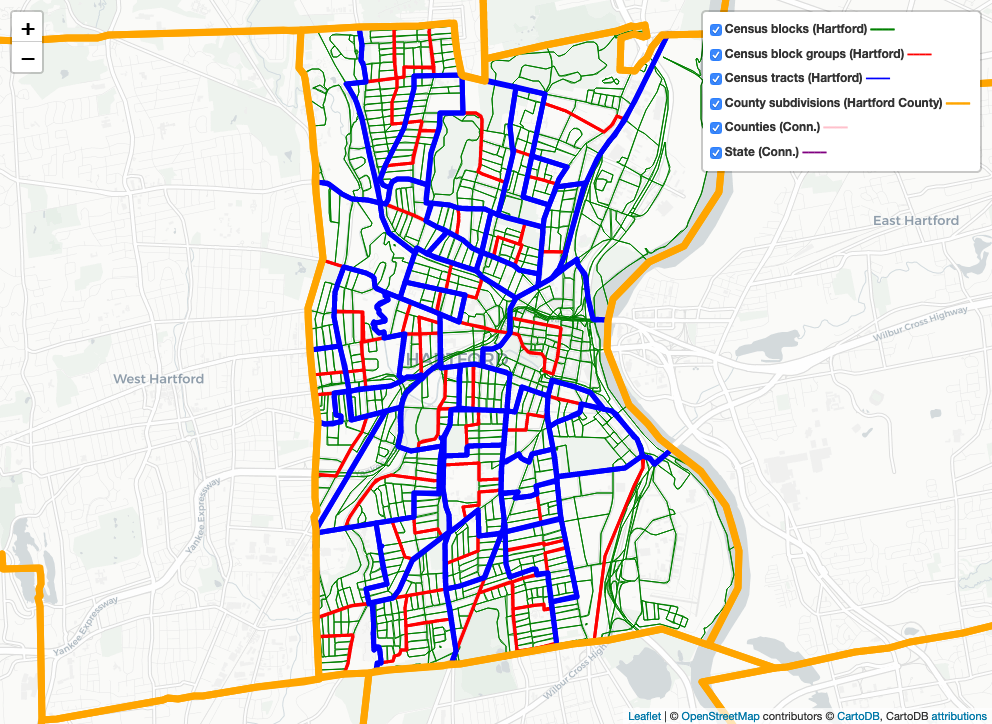

# Census Boundaries for Hartford Area

This repository contains a Jupyter notebook that generates an [interactive map](https://handsondataviz.github.io/census-divisions-hartford/)
of Census boundaries for Hartford, Conn. The map includes:

* Census blocks (within Hartford)
* Census block groups (within Hartford)
* Census tracts (within Hartford)
* County subdivisions (Hartford town itself)
* Counties (Hartford county)
* State (Connecticut)

## Technology

The Jupyter notebook uses `folium` to generate a Leaflet map with CartoDB Positron baselayer.
All boundaries are individual GeoJSON files, from TIGER/Line Shapefiles, saved in `geojson/` folder.

## License
MIT.